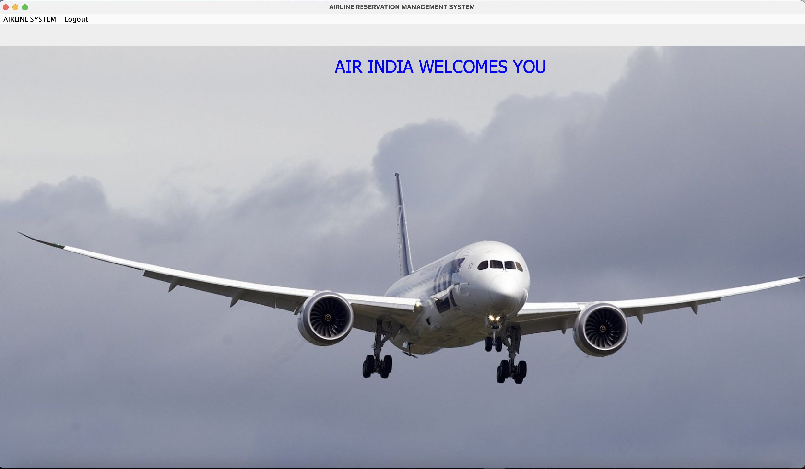
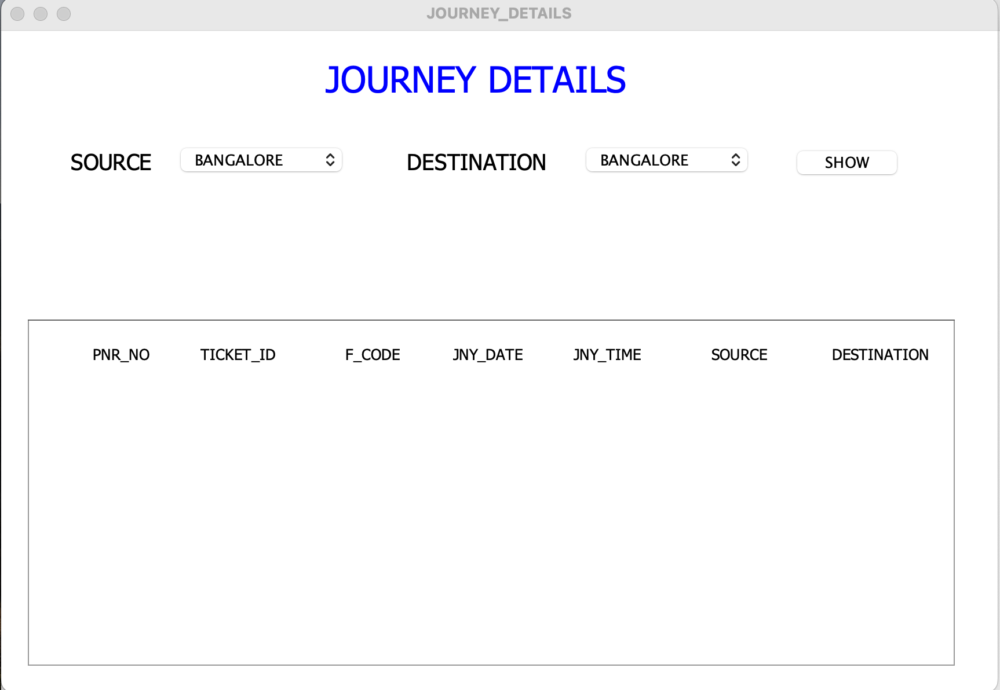

# ✈️ Airline Management System

A desktop-based Java application for managing airline operations such as customer registration, flight bookings, payments, and cancellations. Built using Java Swing for the frontend and MySQL for the backend.

---

## 🚀 Features

- Admin login and authentication
- Add and manage customer details
- Add, view, and cancel flights
- Book and cancel journeys
- Payment interface
- Neat and responsive GUI

---

## 🛠 Technologies Used

- **Java (JDK 8+)**
- **Swing (Java GUI Framework)**
- **MySQL** – Backend database
- **JDBC** – For database connectivity
- **IntelliJ IDEA / Eclipse** – IDE

---

## 📁 Project Structure

```
AirlineManagementSystem/
├── src/
│   ├── AddCustomer.java
│   ├── CancelFlight.java
│   ├── Dashboard.java
│   ├── FlightInfo.java
│   ├── JourneyDetails.java
│   ├── Login.java
│   ├── Payment.java
├── mysql_commands.sql
├── README.md
```

---

## 🗃 Database Setup

1. Start MySQL server.
2. Create the database and tables using the script in `mysql_commands.sql`.

Example:
```sql
CREATE DATABASE airline;
USE airline;

CREATE TABLE customer (
  id INT AUTO_INCREMENT PRIMARY KEY,
  name VARCHAR(100),
  passport_no VARCHAR(50),
  contact VARCHAR(15),
  gender VARCHAR(10)
);
```


## 🖥 How to Run

1. Clone or download the repository.
2. Open the project in your IDE (e.g., IntelliJ IDEA).
3. Add MySQL JDBC Driver to the project libraries.
4. Update DB credentials in your Java files.
5. Run the main class (`Login.java` or `Dashboard.java`).
6. username: admin and password: 12345

 ## 6. Demo

- Login Page:


- Airline Management System Dashboard:



- Add Customer Page:


- Cancel Flight Page:


- Flight Information Page:


- Journey Details Page:



- Flight Payment Page:


---

## 📧 Teammates

- Sameer Raj (Team Leader) - 24SCSE1180422
- Ravi Ranjan              - 24SCSE1180352
- Sumit Singh              - 24SCSE1180161
- Vishal Sharma            - 24SCSE1180312

---

## 📄 License

This project is developed for educational purposes.
